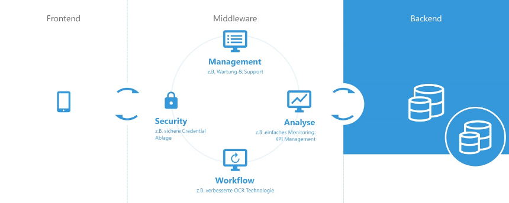

[](https://github.com/christian-draeger/prometheus-with-grafana-example/actions?query=workflow%3A"Continious+Integration")

Spring-Boot Monitoring Setup with Prometheus and Grafana
========================================================

## Prerequisits

* JDK >=8 installed
* docker installed
* docker-compose installed

## TL;DR

### Automated Demo
you can watch a demo running in your Browser
```bash
# it will run a demo in chrome browser
./gradlew build

# if you want to use another browser try (firefox,opera,safari,edge)
./gradlew build -Dbrowser=firefox
```

### Start all services (Middleware & Monitoring)
run from project root:

```bash
./gradlew composeUp
```

### Stop all services
```bash
./gradlew composeDown
```

## Development History and Functional Requirements
### Initial Project Setup

#### Evaluation Phase
##### Server-Framework
We decided to use Spring-Boot over other Frameworks because it has a wide distribution, is a mature technology and has a very extensive community and documentation. Since it is de facto an industry standard at the moment, this decision should ensure that the further development and maintenance of the application should not be a problem for a wide range of developers.
All Frameworks that have been evaluated and would have been a good fit for the project are:
* Spring-Boot
* Ktor
* Quarkus
* Micronaut

#### Tools
Focus of the first development phase was to make it possible to outsource functionality, especially the authentication from the iOS app, as well as enabling a centralised business metric monitoring.
To have the possibility to create date agnostic / time-based reports in the future we decided to use a time series database.  
A time series database (TSDB) is a software system that is optimized for storing and serving time series through associated pairs of time(s) and value(s).

Evaluated TSDBs are:
* [Prometheus](https://en.wikipedia.org/wiki/Prometheus_(software))
* [InfluxDB](https://en.wikipedia.org/wiki/InfluxDB)
* [Graphite](https://en.wikipedia.org/wiki/Graphite_(software))

We decided to use Prometheus because of its excellent spring-boot integration as well as the HTTP pull model it is using to provide metrics from a monitored application.

Visualization of Metrics:
To arrange the metrics on dashboards and provide nice looking and intuitive Monitoring we decided to use [Grafana](https://grafana.com/) because it has a wide range of plugins to visualize all kinds of data, is pretty flexible in terms of datasources, has an active and big community as well as working out of the box with Prometheus. 

#### SCM
We use [git](https://git-scm.com/) as our version control system of choice. The origin server is github (private repository).

#### Creation of initial Project setup
The initial Project setup is a Gradle multi module project consisting of
* the [application](./application/README.md) module, that is representing the middleware
* the [monitoring](./monitoring/README.md) module, where all grafana and prometheus specifics live 
* the [systemTests](./systemTests/README.md) module, where the End-to-End tests are located to verify that the middleware is working properly with the monitoring

All needed tools and the middleware itself can be started conveniently with one command via docker-compose:
```bash
./gradlew start
```
and could thereby be easily deployed to any kind of docker container orchestration like Kubernetes.

After spinning-up everything the service will be accessible as follows:

* [Middleware --> http://localhost:8080](http://localhost:8080)
* [Monitoring --> http://localhost:3000](http://localhost:3000)
* [Time Series Database --> http://localhost:9090](http://localhost:9090)

#### Auto-Check for latest dependency and plugin versions
```
./gradlew dependencyUpdates
```

### Development
#### Architecture
We chose a classical client server architecture including a middleware to handle the communication to 3rd parties and abstract functionalities from the App.



####Sanity and Health checks
We use [actuator](https://docs.spring.io/spring-boot/docs/current/reference/html/production-ready-features.html) to get health-checks and application relevant metrics.
health check: http://localhost:8080/actuator/health

### Create a deployable
Create Fat-Jar (standalone jar including embedded tomcat server):
```bash
# jar file will be placed in ./build/libs
./gradlew bootJar
```

To create a deployable that fits consistently into different infrastructures and is easy to use
a Docker Image including the Fat-Jar can be build via:
```bash
# docker file will be placed in ./build/docker
./gradlew dockerBuildImage
```

### Testing & Continuous Integration
We will build the application on every push to master (including the execution of all automated tests) and publish a docker image.
A working CI config for GitHub actions can be found in the [.github/workflows/gradle.yml](./.github/workflows/gradle.yml) file.

#### Run all tests
```bash
./gradlew build
```

#### Unit & Integration Tests
They are part of the application module and verify the fulfillment of requirements in a strict scope.

#### System Tests
The System Tests / End2End tests will start all components via docker-compose during a test run.
We use them to verify if the configuration between the different components of the middleware (middleware, monitoring, time series database) are working correctly.
The automated test cases are located in the systemTest module.
The system test will remote controll a browser to verify requirements, the default is Chrome.

##### Run with different browser 
######(supported options: chrome, chrome-headless, firefox, firefox-headless, opera, safari, edge, ie)
```bash
./gradlew build -Dbrowser=firefox
```
